# 🚀 JobFit-AI  
**AI-Powered Resume & Job Matching Assistant**

---

### 🏷️ Project Badges  


---

### 📖 Overview  

**JobFit-AI** is an intelligent web application designed to help job seekers improve their chances of landing interviews. It leverages Google Gemini (LLM) to analyze resumes and job descriptions, identify strengths and gaps, generate tailored cover letters, and export an enhanced resume optimized for ATS systems.

From first-time job hunters to experienced professionals, JobFit-AI empowers users with actionable, AI-driven insights — all in a single streamlined workflow.

---

### ✨ Key Features  

- **🎯 Smart Job Matching**  
  Compare your resume against any job description and receive an overall match percentage with detailed breakdowns.

- **📊 Skills Gap Analysis**  
  Instantly identify matching vs. missing skills, with suggestions on how to bridge the gap.

- **🤖 ATS Optimization Suggestions**  
  Get expert tips to make your resume more compatible with Applicant Tracking Systems.

- **💌 Personalized AI Cover Letters**  
  Automatically generate custom, ATS-friendly cover letters in a tone of your choice.

- **📄 Enhanced Resume Export**  
  Download a professionally formatted resume that incorporates optimization feedback and added keywords.

- **🧠 Powered by Google Gemini AI**  
  Uses cutting-edge LLMs to analyze, compare, and enhance your job application materials.

---

### 🖼️ Demo Preview  


1. Home screen with resume and job description input  
2. Analysis result page showing match percentage and skill gaps  
3. AI-generated cover letter preview with download option  
4. Resume enhancement PDF download with integrated ATS suggestions

---

### 🛠️ Tech Stack  

- **Frontend**: Streamlit (Python-based UI framework)  
- **LLM Integration**: Google Gemini API (via Google Generative AI)  
- **Resume Parsing**: PyPDF2, python-docx  
- **PDF Generation**: ReportLab  
- **Data Handling**: Pandas  
- **Visualization**: Plotly  
- **Language**: Python 3.10 or higher

---

### 📦 Installation

To run JobFit-AI locally, follow these steps:

1.  Clone the repository
```bash
git clone https://github.com/AshutoshKY125/JobFit-AI.git
cd JobFit-AI
```

2. Create a virtual environment (recommended)
```bash
python -m venv venv
source venv/bin/activate     # On Windows: venv\Scripts\activate
```
    
3. Install required dependencies
```bash
pip install -r requirements.txt
```
    
4. Run the app
```bash
streamlit run JobFit-AI.py
```
---

### 🔐 API Key Setup

JobFit-AI uses the **Google Gemini API** for all AI tasks. You need a valid API key from Google AI Studio to proceed.

**Steps to get your Gemini API key:**

1.  Go to [Google AI Studio](https://aistudio.google.com/app/apikey)
    
2.  Sign in with your Google account
    
3.  Click **"Create API Key"**
    
4.  Copy the generated API key
    

**How to use the API key:**

You can provide the key in one of three ways:

*   **Option 1**: Paste it directly in the sidebar input on the app
    
*   **Option 2**: Option 2: Add it to your ".streamlit/secrets.toml" file.
```bash
GEMINI_API_KEY = "your-key-here"
```

*   **Option 2**: Option 2: Add it to your ".streamlit/secrets.toml" file.
```bash
export GEMINI_API_KEY="your-key-here"
```
    

> If no key is provided, the app will show a welcome screen asking you to input it manually.1

---

### ▶️ Usage

Once the app is running:

1.  **Enter your Google Gemini API key** in the sidebar.
    
2.  **Upload your resume** (PDF or DOCX).
    
3.  **Paste the job description** from any job listing.
    
4.  Click **"Analyze"** to generate:
    
    *   Resume-to-job match percentage
        
    *   Matching & missing skills
        
    *   Experience & education gap analysis
        
    *   ATS optimization suggestions
        
    *   Personalized cover letter
        
    *   Downloadable enhanced resume (PDF)
        

You can view all results inside the app, switch between tabs, and download any generated content.

---

### 🔍 Detailed Walkthrough

Once you've provided your resume and job description, JobFit-AI walks you through a seamless analysis process:

1.  **Resume Parsing**The app reads and extracts relevant information from your uploaded PDF or DOCX file — including your skills, experience, education, and achievements.
    
2.  **Job Description Analysis**The pasted job description is broken down to extract required skills, qualifications, certifications, and responsibilities.
    
3.  **AI-Powered Matching**Using Google Gemini, the app compares your resume against the job description to generate:
    
    *   Overall match percentage
        
    *   Matching and missing skills
        
    *   Experience and education compatibility
        
    *   Suggestions to improve your resume
        
4.  **Interactive Visual Feedback**Results are shown through metrics, bar charts, and categorized lists for easier interpretation.
    
5.  **ATS Optimization Suggestions**You receive targeted feedback on:
    
    *   Formatting issues
        
    *   Missing keywords
        
    *   Section-wise improvements
        
    *   Overall alignment with ATS standards
        
6.  **Cover Letter Generation**You can choose a tone (professional, enthusiastic, confident, or friendly) and generate a custom, ATS-optimized cover letter tailored to the job role.
    
7.  **Enhanced Resume Export**Download a PDF version of your resume enhanced with formatting, keywords, and AI-generated suggestions.


📂 Output Examples

Some of the outputs generated by JobFit-AI include:

*   **Match Score Example**
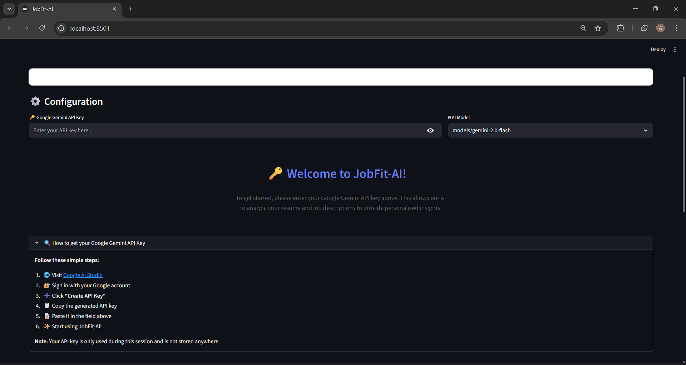
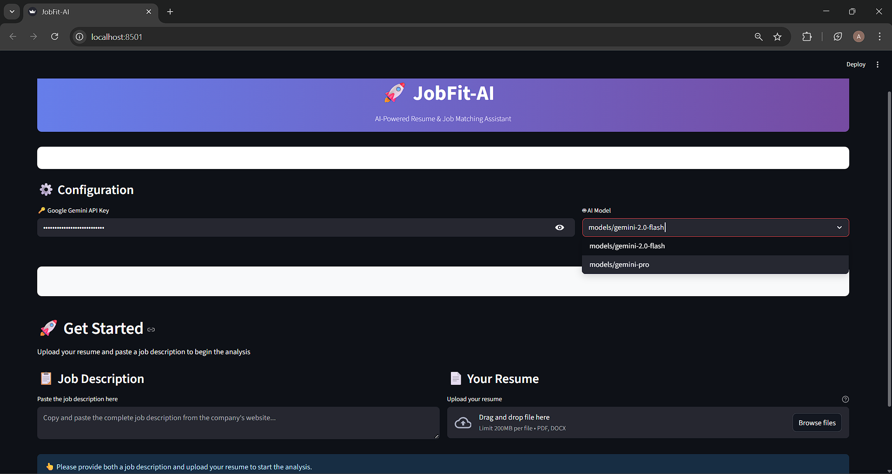
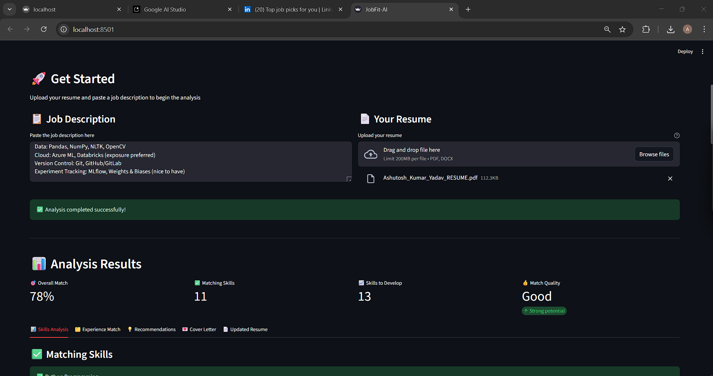

*   **Skills Analysis Chart**
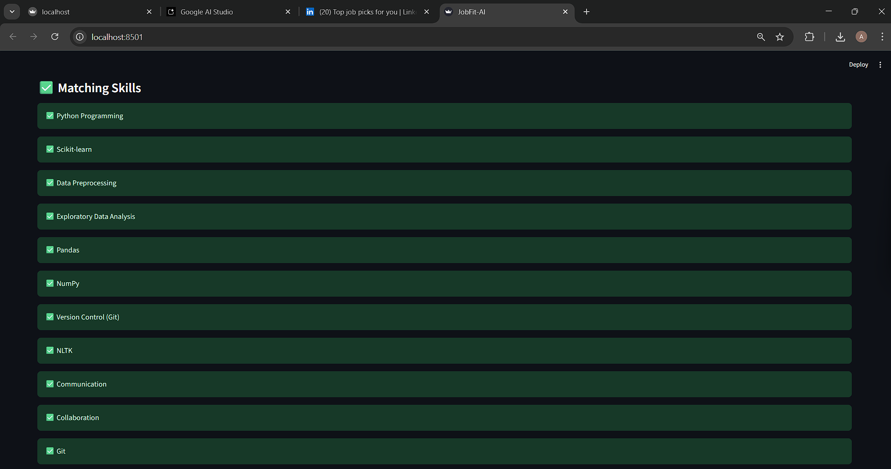
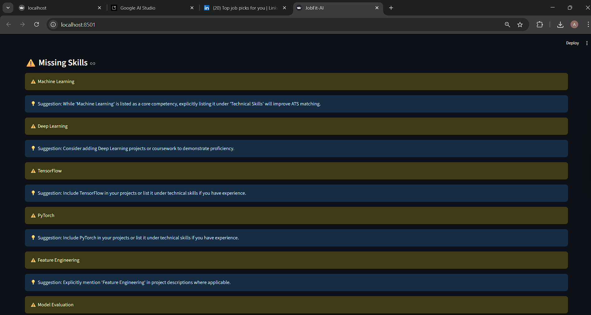
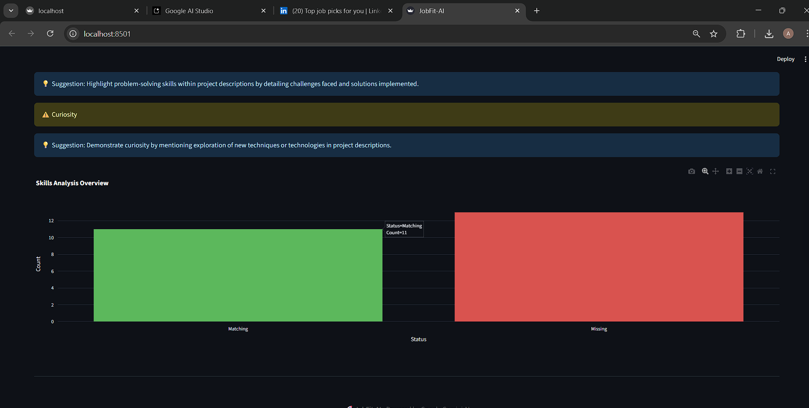
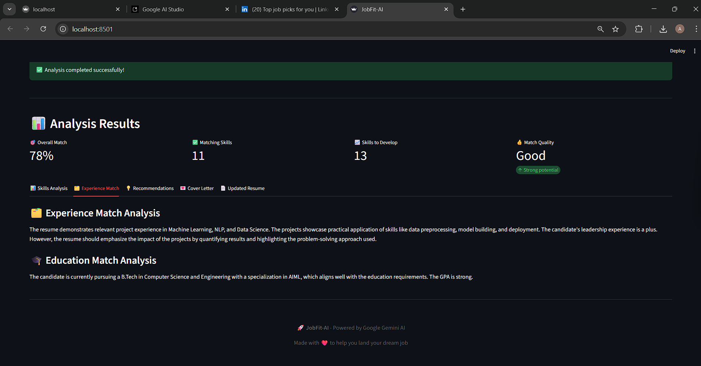

*   **Cover Letter Snippet**
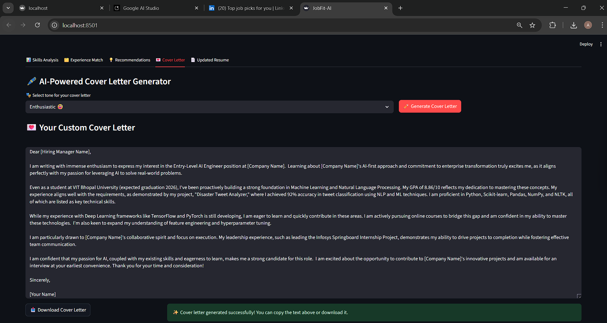

*   **ATS Suggestions Sample**
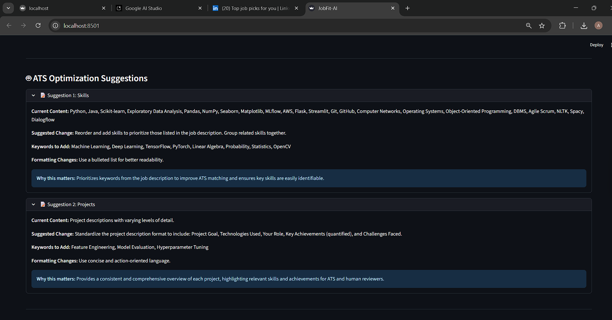
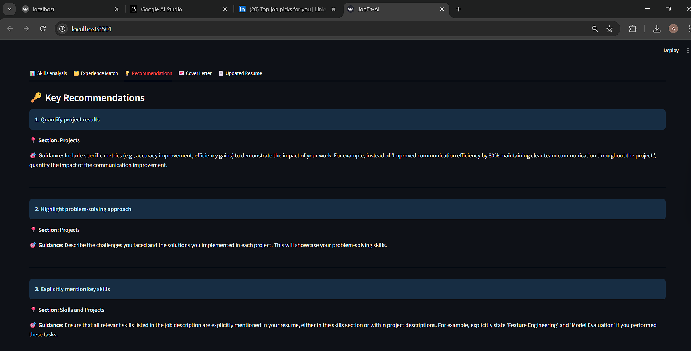

*   **Downloadable PDF**
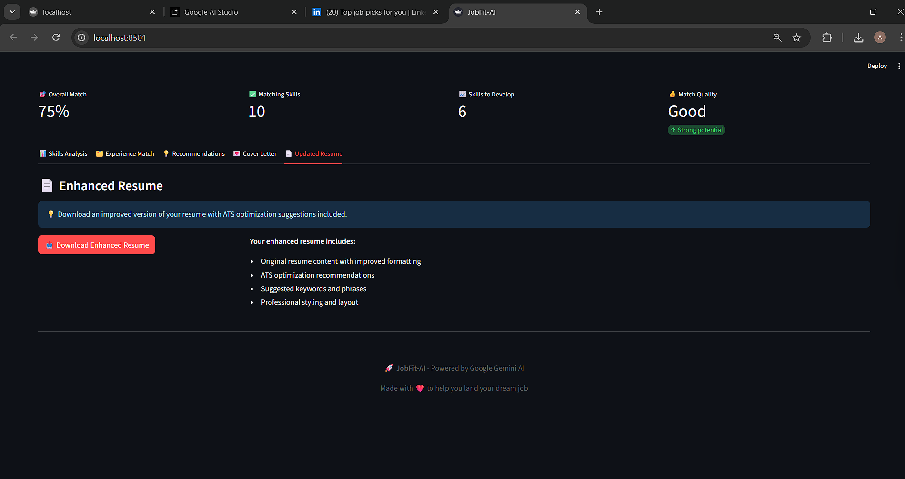
    
    *   Enhanced resume that includes all optimizations
    *   Available for download within the app

---

### 🛣️ Roadmap / Future Improvements

Here are a few planned enhancements for upcoming versions:

*   🔍 **LinkedIn Job Scraper Integration**Paste a LinkedIn job URL and auto-extract the job description.
    
*   🧠 **Smart Suggestions Panel**Get real-time resume suggestions while typing in a built-in editor.
    
*   🌐 **Multi-language Support**Support resume analysis in other languages beyond English.
    
*   📧 **Email-ready Cover Letter Format**Export cover letter directly in email draft format.
    
*   📊 **Resume Scoring History**Save past analyses to track your improvement over time.
